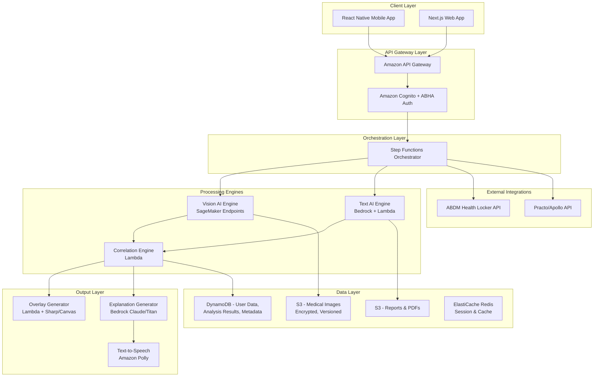
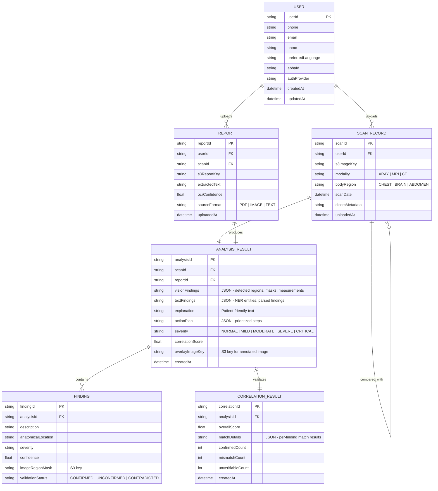
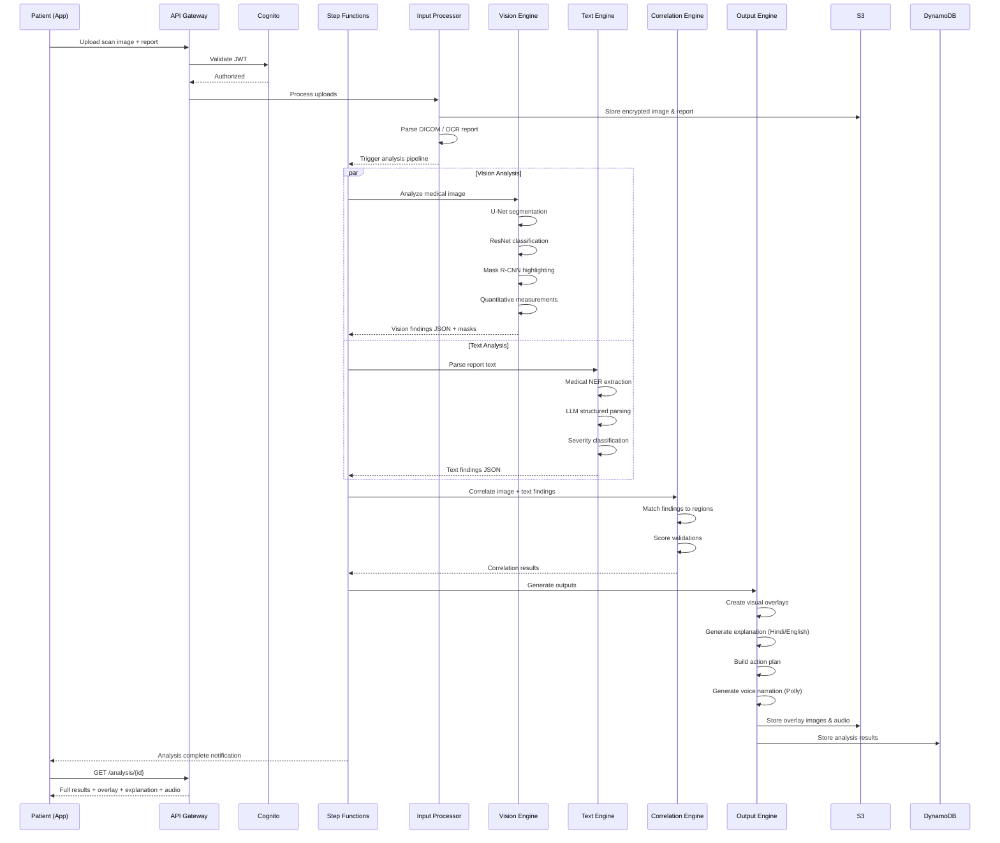
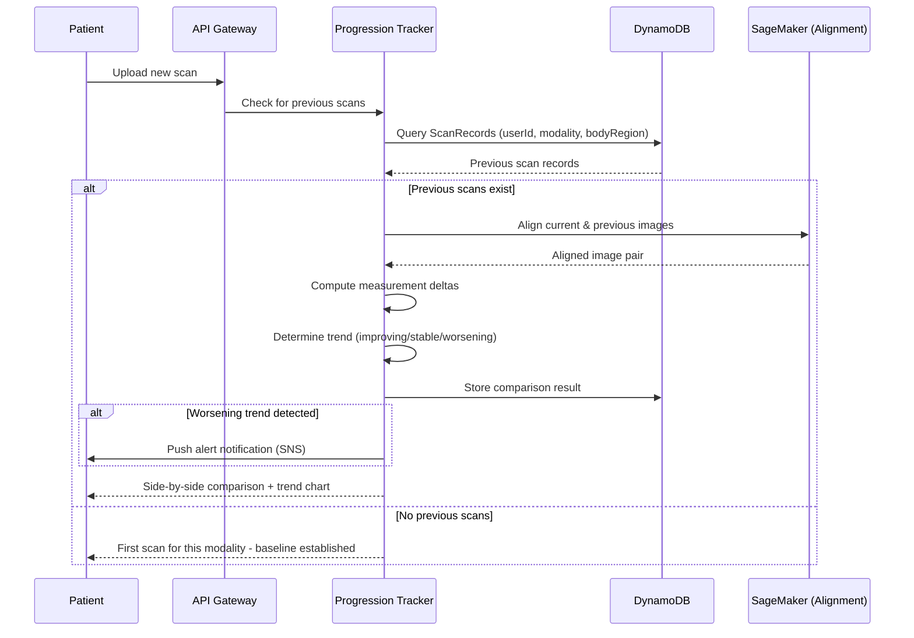

# Design - ReportGuru: Radiology Report Intelligence

## Overview

ReportGuru is a multi-modal AI platform that correlates medical scan images with radiology report text to produce patient-friendly visual explanations. The design addresses all 9 requirements by building four core engines — a Vision AI Engine for medical image analysis, a Text AI Engine for report interpretation, a Correlation Engine for cross-validation, and a Patient Interface for accessible output — deployed on a serverless AWS infrastructure using Amazon Bedrock, SageMaker, and managed services.

### Key Design Principles

- **Multi-Modal AI Architecture**: Separate pipelines for image and text that converge in a correlation layer, rather than a single monolithic model.
- **Serverless-First on AWS**: Leveraging Lambda, API Gateway, S3, and DynamoDB for cost-efficient scaling from 0 to millions of requests.
- **Security by Design**: End-to-end encryption, ABDM compliance, and DPDPA 2023 adherence baked into every layer.
- **Modality Extensibility**: Initial support for chest X-ray and brain MRI, with architecture designed to plug in new modality models without re-architecture.
- **India-First Localization**: Hindi/English default with extensible Indic language support and voice output for accessibility.

---

## Architecture

### High-Level System Architecture



### Architecture Rationale

- **AWS Step Functions** orchestrates the multi-step analysis pipeline (upload → parse → analyze → correlate → explain) with built-in retry logic and error handling.
- **SageMaker Real-Time Endpoints** host the medical CV models (U-Net, ResNet) on GPU instances for sub-10-second inference.
- **Amazon Bedrock** provides managed LLM access (Claude/Titan) for report text interpretation, explanation generation, and translation — no model hosting overhead.
- **S3 with SSE-KMS encryption** stores all medical images and reports with versioning for progression tracking.
- **DynamoDB** provides single-digit millisecond reads for user metadata, analysis results, and audit logs.

---

## Components and Interfaces

### 1. Input Processing Service

**Responsibility:** Accept and normalize medical images (DICOM, JPEG, PNG, PDF) and report text.

| Sub-Component | Technology | Function |
|---|---|---|
| DICOM Parser | `pydicom` + Lambda | Extract pixel data and metadata from DICOM files |
| Image Normalizer | Lambda + Pillow/OpenCV | Convert all image formats to standardized PNG, resize, normalize pixel intensity |
| OCR Service | Amazon Textract | Extract text from scanned report PDFs and images |
| Text Extractor | Lambda + PyMuPDF | Extract text from digital PDFs directly |
| Upload Handler | API Gateway + Lambda | Pre-signed S3 URL generation, file validation, virus scanning |

### 2. Vision AI Engine

**Responsibility:** Analyze medical images to detect organs, segment abnormalities, and produce quantitative measurements.

| Sub-Component | Technology | Function |
|---|---|---|
| Organ Segmentation | U-Net (SageMaker) | Segment lung fields, heart, ribs, brain regions from scan images |
| Abnormality Detection | ResNet-50 (SageMaker) | Classify regions as normal/abnormal with confidence scores |
| Region Highlighting | Mask R-CNN (SageMaker) | Generate pixel-level masks for abnormal regions |
| Quantitative Analyzer | Custom Lambda | Compute lesion sizes (mm), heart-to-thorax ratio, area measurements |
| Reference Comparator | Lambda + DynamoDB | Compare measurements against age/gender normal ranges |

**Model Pipeline:**
```
Input Image → Preprocessing (resize, normalize) 
  → U-Net (organ segmentation masks)
  → ResNet-50 (abnormality classification per region)
  → Mask R-CNN (precise abnormality boundaries)
  → Quantitative Analysis (measurements)
  → Output: Structured JSON + overlay masks
```

### 3. Text AI Engine

**Responsibility:** Parse, interpret, and extract structured medical information from radiology reports.

| Sub-Component | Technology | Function |
|---|---|---|
| OCR Pipeline | Amazon Textract | High-accuracy text extraction from scanned reports |
| Medical NER | Amazon Comprehend Medical | Extract entities: anatomy, conditions, measurements, medications |
| Report Parser | Bedrock (Claude) | Structured extraction of findings, impressions, recommendations |
| Severity Classifier | Lambda + Bedrock | Classify findings into Normal/Mild/Moderate/Severe/Critical |

### 4. Correlation Engine (Secret Sauce)

**Responsibility:** Cross-validate image analysis findings with report text findings and generate confidence scores.

| Sub-Component | Technology | Function |
|---|---|---|
| Finding Matcher | Lambda | Map text-extracted findings to image-detected regions by anatomy |
| Validation Scorer | Lambda | Score each finding: Confirmed (✅), Unconfirmed (⚠️), Contradicted (❌) |
| Confidence Aggregator | Lambda | Compute overall report-image correlation score (0-100%) |
| Discrepancy Reporter | Lambda + Bedrock | Generate patient-safe explanation of any mismatches |

**Correlation Logic:**
```
For each finding in report_text:
  1. Extract anatomical location (e.g., "bilateral lower lobes")
  2. Map to corresponding image region from Vision Engine
  3. Check if Vision Engine detected abnormality in that region
  4. Score: MATCH (both agree) / MISMATCH (disagreement) / UNVERIFIABLE (outside model capability)
  5. Aggregate into overall correlation confidence
```

### 5. Explanation & Output Engine

**Responsibility:** Generate patient-friendly explanations, visual overlays, voice narration, and action plans.

| Sub-Component | Technology | Function |
|---|---|---|
| Overlay Generator | Lambda + Sharp.js | Composite color-coded overlays (red/yellow/green) onto original scan image |
| Explanation Generator | Bedrock (Claude) | Generate 8th-grade-level explanation from structured analysis results |
| Language Translator | Bedrock (Claude) + Amazon Translate | Translate explanations to Hindi, Tamil, Telugu, Kannada, Bengali, Marathi |
| Voice Narrator | Amazon Polly | Convert text explanation to speech in selected Indic language |
| Action Plan Builder | Lambda + Bedrock | Generate prioritized next-steps based on severity and findings |
| Report Packager | Lambda + PDFKit | Generate second-opinion PDF with annotations, measurements, clinical summary |

### 6. Progression Tracking Service

**Responsibility:** Compare current scans with historical data to identify health trends.

| Sub-Component | Technology | Function |
|---|---|---|
| Scan Matcher | Lambda + DynamoDB | Identify previous scans of same type/body region for the user |
| Image Aligner | SageMaker (registration model) | Spatially align current and previous scans for comparison |
| Trend Analyzer | Lambda | Compute delta measurements, trend direction (improving/stable/worsening) |
| Alert Generator | Lambda + SNS | Push notifications when worsening trends are detected |

---

## Data Models



### DynamoDB Table Design

| Table | Partition Key | Sort Key | GSI |
|---|---|---|---|
| Users | `userId` | — | `phone-index` (phone), `abha-index` (abhaId) |
| ScanRecords | `userId` | `scanDate#scanId` | `modality-index` (modality, scanDate) |
| Reports | `userId` | `reportId` | `scanId-index` (scanId) |
| AnalysisResults | `scanId` | `analysisId` | `userId-index` (userId, createdAt) |
| AuditLog | `userId` | `timestamp#eventId` | — |

---

## API Design

### REST API Endpoints

| Endpoint | Method | Purpose | Auth | Requirements |
|---|---|---|---|---|
| `/auth/otp/send` | POST | Send OTP to mobile number | Public | R9.1 |
| `/auth/otp/verify` | POST | Verify OTP and issue JWT | Public | R9.1 |
| `/auth/abha/link` | POST | Link ABHA ID to account | JWT | R8.2 |
| `/upload/scan` | POST | Get pre-signed URL for scan upload | JWT | R1.1, R1.2 |
| `/upload/report` | POST | Get pre-signed URL for report upload | JWT | R2.1, R2.2, R2.3 |
| `/analyze` | POST | Trigger full analysis pipeline | JWT | R3, R4, R5 |
| `/analysis/{id}` | GET | Retrieve analysis results | JWT | R5.1 |
| `/analysis/{id}/overlay` | GET | Get annotated scan image | JWT | R3.2 |
| `/analysis/{id}/audio` | GET | Get voice explanation audio | JWT | R5.6 |
| `/analysis/{id}/share` | POST | Generate second-opinion package | JWT | R7.1, R7.3 |
| `/scans/compare` | POST | Compare two scans for progression | JWT | R6.1, R6.2 |
| `/timeline` | GET | Get health timeline for user | JWT | R6.5 |
| `/user/language` | PUT | Update language preference | JWT | R9.4 |
| `/user/data` | DELETE | Request data deletion | JWT | R8.3 |

### WebSocket Endpoint

| Endpoint | Purpose |
|---|---|
| `wss://api/ws/analysis/{id}` | Real-time analysis progress updates (upload → OCR → vision → correlation → explanation) |

---

## Sequence Diagrams

### Primary Flow: Upload & Analyze



### Progression Tracking Flow



---

## Error Handling Strategy

| Error Category | Handling Approach | User Impact |
|---|---|---|
| Upload failure (corrupt file) | Validate format before S3 upload; return specific error code | "Your file could not be read. Please try re-uploading in DICOM, JPEG, or PDF format." |
| OCR low confidence (<90%) | Flag sections; allow user to manually correct text | "Some parts of your report were hard to read. Please check the highlighted sections." |
| Vision model timeout | Step Functions retry with exponential backoff (3 attempts) | "Analysis is taking longer than usual. We'll notify you when ready." |
| Unsupported modality | Graceful degradation — skip vision analysis, provide text-only explanation | "We can't analyze this scan type yet, but here's what your report says." |
| Correlation mismatch | Flag discrepancy without alarm; recommend specialist review | "We noticed some differences. Consider showing this to your doctor." |
| Auth failure | Return 401; prompt re-login | Standard re-authentication flow |
| Rate limiting | API Gateway throttling (100 req/sec per user) | "Please wait a moment before trying again." |

---

## Security Considerations

- **Authentication:** Amazon Cognito with mobile OTP (primary), Google OAuth, and ABHA ID federation.
- **Authorization:** JWT-based with role claims (patient, admin). Patients can only access their own data.
- **Encryption at Rest:** S3 SSE-KMS for all medical images and reports. DynamoDB encryption enabled.
- **Encryption in Transit:** TLS 1.3 enforced on all API Gateway endpoints.
- **Audit Logging:** Every data access, modification, and deletion logged to DynamoDB AuditLog table and CloudTrail.
- **Data Deletion:** Automated pipeline triggered on user request — purges S3 objects, DynamoDB records, and SageMaker cached data within 48 hours.
- **ABDM Compliance:** ABHA ID integration, Health Locker API sync, consent-based data sharing.
- **DPDPA 2023 Compliance:** Data localization (ap-south-1 Mumbai region only), purpose limitation, consent management, right to erasure.
- **Medical Disclaimer:** Every analysis output includes a mandatory disclaimer — "This is for educational purposes only. Consult your doctor for diagnosis and treatment."

---

## Performance Considerations

| Metric | Target | Strategy |
|---|---|---|
| Time to explanation (X-ray) | < 30 seconds | SageMaker real-time endpoints on `ml.g5.xlarge`; parallel vision + text pipelines |
| Time to explanation (MRI) | < 60 seconds | Multi-slice processing with batch inference |
| Upload speed | < 5 seconds for 50MB DICOM | Pre-signed S3 URLs with multipart upload |
| API response time | < 200ms for GET endpoints | ElastiCache Redis for frequently accessed results |
| Concurrent users | 10,000+ | Lambda auto-scaling; API Gateway caching |
| Cold start mitigation | < 2s Lambda init | Provisioned concurrency for critical Lambdas |
| Cost optimization | < ₹5 per analysis | SageMaker Serverless Inference for off-peak; Savings Plans for steady-state |

---

## Testing Strategy

| Test Type | Scope | Tools |
|---|---|---|
| Unit Tests | Individual Lambda functions, parsers, matchers | pytest, Jest |
| Integration Tests | End-to-end pipeline (upload → analysis → output) | AWS SAM local, Step Functions local |
| Model Accuracy Tests | Vision model performance on benchmark datasets | Custom eval scripts on CheXpert, MIMIC-CXR datasets |
| Correlation Accuracy Tests | Cross-validation correctness against radiologist-verified cases | Manual test suite of 500+ annotated cases |
| Load Tests | API Gateway + Lambda throughput | Artillery, k6 |
| Security Tests | Authentication, authorization, encryption validation | OWASP ZAP, AWS Inspector |
| Accessibility Tests | Voice output, screen reader, language accuracy | Manual QA + Axe |

---

## Integration Points

| External System | Protocol | Purpose | Requirements |
|---|---|---|---|
| ABDM Health Locker | REST API (ABDM Gateway) | Sync health records, ABHA ID verification | R8.2 |
| Amazon Bedrock (Claude/Titan) | AWS SDK | LLM for report parsing, explanation generation, translation | R2.4, R5.1, R5.5 |
| Amazon Textract | AWS SDK | OCR for scanned reports | R2.1 |
| Amazon Comprehend Medical | AWS SDK | Medical NER extraction | R2.4 |
| Amazon Polly | AWS SDK | Text-to-speech in Indic languages | R5.6 |
| Amazon Translate | AWS SDK | Indic language translation | R5.5 |
| Amazon SageMaker | AWS SDK | Host U-Net, ResNet, Mask R-CNN models | R3.1, R3.2, R3.3 |
| Practo / Apollo 24/7 | REST API | Share second-opinion packages | R7.3 |
| Amazon SNS | AWS SDK | Push notifications for alerts | R6.4 |
| Amazon CloudWatch | AWS SDK | Monitoring, logging, alerting | Operational |

---

## AWS Services Summary

| Service | Usage | Region |
|---|---|---|
| API Gateway | REST + WebSocket APIs | ap-south-1 |
| Lambda | Business logic, orchestration handlers | ap-south-1 |
| Step Functions | Analysis pipeline orchestration | ap-south-1 |
| S3 | Medical image & report storage | ap-south-1 |
| DynamoDB | User data, analysis results, audit logs | ap-south-1 |
| SageMaker | Medical CV model hosting (U-Net, ResNet, Mask R-CNN) | ap-south-1 |
| Bedrock | LLM inference (Claude/Titan) | ap-south-1 |
| Cognito | Authentication (OTP, Google, ABHA) | ap-south-1 |
| Textract | OCR for scanned reports | ap-south-1 |
| Comprehend Medical | Medical NER | us-east-1 (if unavailable in ap-south-1) |
| Polly | Text-to-speech | ap-south-1 |
| Translate | Language translation | ap-south-1 |
| ElastiCache | Redis caching | ap-south-1 |
| SNS | Push notifications | ap-south-1 |
| CloudFront | CDN for web app | Global |
| CloudWatch | Monitoring & logging | ap-south-1 |
| KMS | Encryption key management | ap-south-1 |
